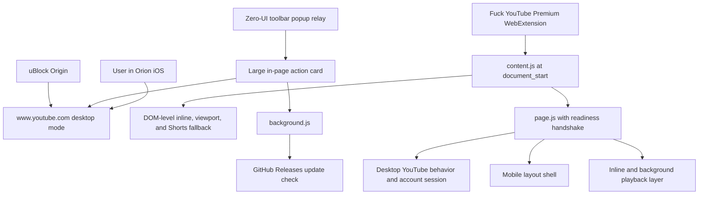

# Architecture — Fuck YouTube Premium

This document is the technical contract for agents continuing the project.

**Current shipped version:** `2.0.13`
**Repository:** `https://github.com/aditauqir/fyp.git`
**Primary target:** Orion Browser on iPhone, using an install-from-file WebExtension

## Product model

The extension is intentionally a hybrid:

- **Backend:** the real desktop `www.youtube.com` application, data model, account session, navigation, and video player.
- **Frontend shell:** a narrow-screen interface applied by the extension so desktop YouTube is usable like mobile YouTube on an iPhone.
- **Playback layer:** small page-context patches that keep video inline and allow background audio.
- **Ad blocking:** uBlock Origin runs alongside this extension. Do not try to replace uBlock Origin with a new network-blocking system.

This is not a replacement YouTube client, proxy, scraper, or embedded player. No separate application backend is hosted by this project.



## Non-negotiable behavior

| Area | Required behavior |
|---|---|
| Host | Use `www.youtube.com` with `app=desktop&persist_app=1`. |
| Player | Full-width, inline video above metadata and comments. |
| Play | The first user tap must call the native `play()` path and start playback. |
| Fullscreen | Starting playback must not trigger fullscreen; only a tap on YouTube’s fullscreen control grants a two-second entry window. |
| PiP | Disabled. Starting playback must not enter PiP. |
| Background audio | Continue playing when Orion is backgrounded or the phone is locked when WebKit permits it. |
| Layout | No content clipped beyond the left or right viewport edge. |
| Feed | One-column phone layout at narrow widths. |
| Navigation | Only YouTube’s native hamburger drawer. No permanent mini-guide column and no custom bottom navigation. |
| Drawer state | Leave YouTube’s drawer attributes and Polymer properties alone. |
| Shorts | Hide Shorts links, shelves, and drawer entries; redirect `/shorts` to Home. |
| Miniplayer | Hide and dismiss YouTube’s miniplayer. |
| Comments | Place comments below the description; initially show three with Load more/Load less controls. |
| Extension action | A zero-UI `default_popup` relays the toolbar tap directly to the YouTube content script, closes, and toggles a visible in-page card with three changelog lines and two large buttons. |
| Ads | Expect uBlock Origin to handle network ad blocking. |

## Runtime layers

### 1. Extension manifests

Two packages are produced because Orion’s support can vary:

- `chrome-extension/manifest.json`: Manifest V3; preferred Orion install.
- `firefox-extension/manifest.json`: Manifest V2; fallback Orion install.

Both packages run `content.js` at `document_start`, expose `page.js`, provide the extension-icon action card, and run the update checker.

### 2. Isolated-world bridge

`content.js` runs in the extension’s isolated world. It injects the packaged `page.js` file into the document so playback and page API patches affect YouTube’s own JavaScript environment.

The page runtime sets `data-fyp-page-ready` with its exact version. The content bridge checks that signal instead of assuming that an appended script executed. If external script loading fails, it removes the stale node, fetches the packaged source, copies YouTube’s script nonce when available, and retries inline.

Critical DOM behavior is intentionally duplicated at this boundary because DOM changes cross isolated-world boundaries even when prototype patches do not. The content layer always:

- marks existing and newly inserted videos `playsinline` and `webkit-playsinline`;
- repeats inline marking before pointer, touch, click, and Play events;
- hides Shorts surfaces and blocks Shorts navigation;
- constrains top-level watch containers to `100vw`.

### 3. Page-context runtime

`youtube-mobile-background.user.js` is the source of truth. During a build, its userscript header is removed and its body becomes each package’s generated `page.js`.

The page runtime owns:

- desktop-host enforcement;
- inline and background playback behavior;
- mobile breakpoint CSS;
- Shorts, miniplayer, upload, and navigation cleanup;
- comments layout and controls;
- repeated DOM reconciliation after YouTube SPA navigation.

Never edit `chrome-extension/page.js` or `firefox-extension/page.js` directly. They are generated files.

### 4. Popup and update service

Orion iOS did not reliably fire the v2.0.12 background `action.onClicked` handler. Both manifests now assign `popup.html`, but this surface is a one-pixel transparent relay with no controls of its own. It queries the active tab, sends `toggleActionCard` directly to the YouTube content script, and closes. This avoids Orion’s unreliable popup-to-background path and prevents a full-page popup UI.

The in-page action card is isolated in a closed Shadow DOM, is at most 22rem wide, and shows three short release-note lines with exactly two large actions:

1. Open desktop YouTube.
2. Check the latest GitHub Release.

`background.js` checks the GitHub Releases API every six hours and shows an `UP` badge when a newer version exists. The action card first messages that service. If Orion suspends or omits it, the card performs the same request directly.

This is an update notification and download flow, not silent OTA installation. Orion requires the downloaded ZIP to be installed manually.

## Playback architecture

Playback code must be conservative because the user gesture is valuable on iOS.

### Inline start

When a video is created through `Document.createElement` or `createElementNS`, and again immediately before delegating to native `HTMLMediaElement.prototype.play()`:

1. Add `playsinline`.
2. Add `webkit-playsinline`.
3. Set `video.playsInline = true`.
4. Set `video.disablePictureInPicture = true`.
5. Call the untouched native `play()` method and return its result.

`installInlinePlaybackGuard()` performs this work. It must not swallow the Play promise or manufacture a replacement result. It gates video/player fullscreen APIs until `recordFullscreenIntent()` observes the real fullscreen control.

### Prohibited playback techniques

Do not:

- call `webkitSetPresentationMode()` during Play;
- call `webkitEnterFullscreen()` or `webkitExitFullscreen()`;
- permanently disable `requestFullscreen()` or WebKit fullscreen methods; they must remain available after explicit fullscreen intent;
- remove YouTube fullscreen classes after Play;
- intercept the user’s Play click and attempt a second synthetic click;
- request PiP from a visibility, blur, freeze, or background event.

Versions 2.0.8–2.0.9 used aggressive fullscreen guards. Those transitions consumed or disrupted Orion’s first user gesture and caused Play to fail or switch presentation modes.

### Background audio

The page reports visible state to YouTube while retaining native visibility descriptors internally. When native WebKit reports that the page is hidden, the extension:

- remembers whether playback was active;
- blocks YouTube pauses only for the active video under the guarded conditions;
- retries native `play()` after short delays;
- installs Media Session play and pause handlers;
- uses the optional WebKit Audio Session playback type when available.

A visible-page pause is treated as user intent and must remain paused.

## Mobile shell architecture

The desktop site is already responsive, but its narrow watch layout has desktop minimum widths. At a 390px viewport, YouTube applied a roughly 426.7px minimum to `#primary`, centering the column and clipping about 18px from the left.

At `max-width: 700px`, the extension:

- constrains app and watch roots to the viewport;
- removes the watch primary column’s desktop minimum width;
- gives watch content a 12px left and right gutter;
- leaves the video player full-bleed;
- constrains metadata, panels, actions, and comments to 100%;
- changes rich feeds to one item per row;
- clips accidental horizontal overflow at the document boundary.

Do not apply transforms, negative margins, fixed pixel widths, or document-wide scale/zoom to imitate a phone layout.

## Navigation architecture

YouTube’s native guide button and drawer own all open/close behavior.

The extension may:

- keep the hamburger button visible;
- hide `ytd-mini-guide-renderer`;
- set mini-guide width CSS variables to zero;
- hide Shorts entries inside the drawer.

The extension must not:

- remove `guide-persistent` or `mini-guide-visible` attributes;
- set `guidePersistent`, `miniGuideVisible`, or drawer `opened` properties;
- remove swipe-control attributes;
- close the drawer from touch or scroll events;
- add a replacement sidebar or bottom navigation bar.

## DOM reconciliation

YouTube is a single-page application and replaces components after navigation. The runtime therefore combines:

- `yt-navigate-finish`, `popstate`, visibility, and lifecycle listeners;
- one document mutation observer with queued scanning;
- targeted intervals for fast-moving ad controls and slower UI reconciliation.

Reconciliation functions should be idempotent: running them repeatedly must not duplicate controls, reorder the page endlessly, or change native component state.

Prefer hiding or styling a native element over reparenting it. Only move DOM nodes when the product behavior explicitly requires a different order, such as comments below the description.

## Source and build flow

```text
youtube-mobile-background.user.js
             |
             v
    rebuild-extension.sh
       |             |
       v             v
Chrome MV3 ZIP   Firefox MV2 ZIP
```

Required edit flow:

1. Edit `youtube-mobile-background.user.js`.
2. Bump its `@version`.
3. Edit the action-card source in `firefox-extension/content.template.js` and shared background source under `firefox-extension/` when needed.
4. Run `./rebuild-extension.sh`.
5. The script regenerates both `page.js` files, copies shared popup/background files to Chrome, updates both manifests, syntax-checks JavaScript, and creates both ZIPs.
6. Run the tests under `tests/`.

Current package names:

- `fuck-youtube-premium-chrome-2.0.13.zip`
- `fuck-youtube-premium-firefox-2.0.13.zip`

## Verification contract

Before publishing:

```bash
./rebuild-extension.sh
node tests/background-update.test.cjs
node tests/content-fallback.test.cjs
node tests/inline-playback-layout.test.cjs
node tests/popup-bridge.test.cjs
git diff --check
```

Then test at an iPhone-sized viewport and, when possible, on Orion iOS:

1. One Play tap starts video inline.
2. No fullscreen or PiP transition occurs from Play; the fullscreen control still works.
3. Video keeps playing while the user scrolls through metadata and comments.
4. Background audio resumes when the page is hidden.
5. Left and right edges remain inside the viewport.
6. Player remains full-width.
7. Home and recommendation feeds are one column.
8. Hamburger opens the native drawer once.
9. No mini-guide column or Shorts entry appears.
10. The extension icon toggles a visible, non-fullscreen in-page card with three changelog lines and two large buttons.

Browser-based desktop testing cannot prove Orion’s app-level `WKWebView` configuration. Treat an actual Orion iPhone test as the final authority for playback presentation behavior.

## Release architecture

Releases are published to `aditauqir/fyp`.

Rules:

- Never delete an older release or its assets.
- The newest release title is `Fuck YouTube Premium <version>`.
- After publishing a new version, rename each older release title to `[DEPRECATED] Fuck YouTube Premium <version>`.
- Upload both Chrome and Firefox ZIP assets.
- Keep the ZIP files in the repository’s Downloads workspace as local deliverables.
- Verify the release and direct asset URLs after upload.

## File ownership

| File | Purpose |
|---|---|
| `ARCHITECTURE.md` | Product and technical architecture contract. |
| `HANDOFF.md` | Current state, history, agent checklist, and known regressions. |
| `PATCH_NOTES.md` | Canonical versioned changelog and source for release/popup copy. |
| `README.md` | User-facing overview and installation instructions. |
| `INSTALL-ORION.md` | Detailed Orion installation and troubleshooting. |
| `youtube-mobile-background.user.js` | Authoritative page-runtime source. |
| `rebuild-extension.sh` | Build, synchronization, validation, and packaging. |
| `firefox-extension/content.template.js` | Stable page-context injection bridge template. |
| `firefox-extension/background.js` | Update checker shared with Chrome. |
| `firefox-extension/popup.*` | One-pixel `default_popup` compatibility relay that forwards toolbar taps to the active YouTube tab and closes. |
| `chrome-extension/page.js` | Generated; do not edit directly. |
| `firefox-extension/page.js` | Generated; do not edit directly. |
| `tests/` | Regression tests. |

## Agent handoff checklist

When another agent takes over:

1. Read this file, `HANDOFF.md`, and the source header/constants.
2. Check `git status` and preserve unrelated user changes.
3. Confirm the source, manifests, ZIP names, and latest GitHub Release use the same version.
4. Make changes in authoritative sources, not generated `page.js`.
5. Preserve the desktop-backend/mobile-shell boundary.
6. Do not fight native Play, drawer, or WebKit presentation state.
7. Rebuild both packages and run the verification contract.
8. Update documentation when architecture or user-visible behavior changes.
