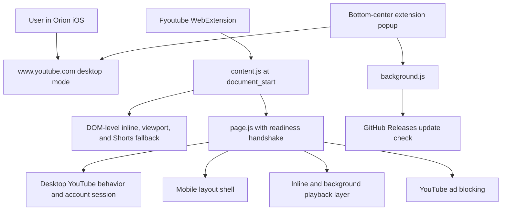
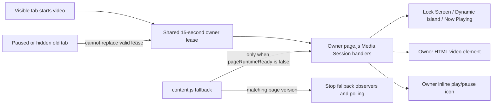

# Architecture — Fyoutube

This document is the technical contract for agents continuing the project.

**Current shipped version:** `3.2.15` (`3.2.15_release.zip`)
**GitHub Release:** `Fyoutube 3.2.15` (`v3.2.15`)
**Repository:** `https://github.com/aditauqir/fyp.git`
**Primary target:** Orion Browser on iPhone, using an install-from-file WebExtension

## Product model

The extension is intentionally a hybrid:

- **Backend:** the real desktop `www.youtube.com` application, data model, account session, navigation, and video player.
- **Frontend shell:** a narrow-screen interface applied by the extension so desktop YouTube is usable like mobile YouTube on an iPhone.
- **Playback layer:** small page-context patches that keep video inline and allow background audio.
- **Ad blocking:** The page runtime blocks YouTube ad requests, prunes player-ad JSON, hides overlay cards, and skips in-player ads. uBlock Origin is optional.

This is not a replacement YouTube client, proxy, scraper, or embedded player. No separate application backend is hosted by this project.

## Internal Chromium diagnostics workbench

The branch also contains a maintainer-only Chromium MV3 diagnostics tool under [`workbench/youtube-diagnostics`](./workbench/youtube-diagnostics). It is separate from the shipped Fyoutube runtime and is not part of the Orion release packages.

The workbench captures page-world console calls, page errors, unhandled rejections, SPA navigation, interaction targets, DOM mutation summaries, and structured element snapshots. **Capture DOM + code** saves the element map into the JSONL session log and downloads the current `document.documentElement.outerHTML` as a separate HTML source artifact. **Pause capture** must be used before opening DevTools or reproducing a crash when the page is unstable; pausing stops new DOM snapshots, mutation accumulation, and page-world diagnostic emission.

The current investigation artifacts are kept in [`workbench/logs`](./workbench/logs):

- `youtube-diagnostics-2026-09-29T04-48-33-682Z.jsonl` — console, error, navigation, mutation, and element records.
- `youtube-dom-2026-09-29T04-48-31-117Z.html` — captured YouTube DOM/source snapshot.

These files are diagnostic evidence, not source-of-truth product code. The workbench uses Chromium APIs only, starts a clean storage buffer when its storage schema changes, and must never be wired into `youtube-mobile-background.user.js` or generated `page.js`.

## Internal Safari diagnostics workbench

The native macOS Safari companion lives under [`workbench/youtube-diagnostics-safari`](./workbench/youtube-diagnostics-safari). It embeds the same page-world hook, WebKit media lifecycle records, Fyoutube marker checks, and DOM capture UI in a Safari Web Extension host project. Its extension resources use `globalThis.browser || globalThis.chrome` so the same WebExtension logic remains compatible with Safari and Chromium API globals.

Run `workbench/youtube-diagnostics-safari/package-safari.sh` to perform an unsigned Debug build and create a source project archive for local Xcode testing. Safari requires the host app to be signed by Xcode with the user's development team; the unsigned command-line build is a structural verification only.


```mermaid
flowchart TD
    U["User in Orion iOS"] --> O["www.youtube.com desktop mode"]
    E["Fyoutube WebExtension"] --> C["content.js at document_start"]
    C --> F["DOM-level inline, viewport, and Shorts fallback"]
    C --> P["page.js with readiness handshake"]
    P --> B["Desktop YouTube behavior and account session"]
    P --> M["Mobile layout shell"]
    P --> V["Inline and background playback layer"]
    P --> D["YouTube ad blocking"]
    W["background.js"] --> G["GitHub Releases update check"]
    X["Bottom-center extension popup"] --> O
    X --> W
```

## Non-negotiable behavior

| Area | Required behavior |
|---|---|
| Host | Use `www.youtube.com` with `app=desktop&persist_app=1`. |
| Player | Full-width, inline video above metadata and comments. |
| Play | The first user tap must call the native `play()` path and start playback. |
| Fullscreen | Starting playback must not trigger fullscreen; only a tap on YouTube’s fullscreen control grants a two-second entry window. |
| PiP | Disabled. Starting playback must not enter PiP. |
| Background audio | Continue playing when Orion is backgrounded or the phone is locked when WebKit permits it. |
| Now Playing | Lock Screen, Dynamic Island, and Now Playing play/pause must control the same video as the in-page toolbar and keep that toolbar icon in sync. |
| Layout | No content clipped beyond the left or right viewport edge. |
| Feed | One-column phone layout at narrow widths. |
| Navigation | Only YouTube’s native hamburger drawer. No permanent mini-guide column and no custom bottom navigation. |
| Drawer state | Leave YouTube’s drawer attributes and Polymer properties alone. |
| Shorts | Hide Shorts links, shelves, and drawer entries; redirect `/shorts` to Home. |
| Miniplayer | Hide and dismiss YouTube’s miniplayer. |
| Comments | Order the watch page as description, playlist when present, recommendations, then YouTube’s native comments. Do not force-open or custom-paginate comments. Do not move all of `#secondary`. |
| Reply editor | Use a 16px minimum editor font to avoid iOS focus zoom. |
| Player controls | Keep controls visible for ten seconds after user interaction, then return autohide ownership to YouTube. |
| Captions | Keep YouTube’s custom captions and hide only the duplicate native WebVTT cue when both layers exist. |
| Extension action | A real `default_popup` renders a bottom-center panel with three changelog lines and two large buttons; it must not inject an in-page action card. |
| Ads | Block YouTube ads in page-world fetch/XHR/beacon, prune player-ad JSON, hide overlay cards, and skip in-player ads. uBlock Origin is not required. |
| Search cards | Restyle only `ytd-search` results. Stack the thumbnail first. Do not restyle Home, subscriptions, or channel browse with search-card rules. |
| Search entry | Tapping YouTube's masthead search control opens a separate FYP-owned overlay with a slight blur. Ask YouTube and voice search controls stay hidden. |
| Search submit | Enter or the overlay Search button navigates to `https://www.youtube.com/results?search_query=<query>` using `URLSearchParams`, which produces YouTube's `+` separators for spaces. |

## Runtime layers

### 1. Extension manifests

Two packages are produced because Orion’s support can vary:

- `chrome-extension/manifest.json`: Manifest V3; preferred Orion install.
- `firefox-extension/manifest.json`: Manifest V2; fallback Orion install.

Both packages run `content.js` at `document_start`, expose `page.js`, provide the extension-icon action card, and run the update checker.

### 2. Isolated-world bridge

`content.js` runs in the extension’s isolated world. It injects the packaged `page.js` file into the document so playback and page API patches affect YouTube’s own JavaScript environment.

The page runtime sets `data-fyp-page-ready` with its exact version. The content bridge checks that signal instead of assuming that an appended script executed. If external script loading fails, it removes the stale node, fetches the packaged source, copies YouTube’s script nonce when available, and retries inline.

Critical DOM behavior is intentionally duplicated at this boundary because DOM changes cross isolated-world boundaries even when prototype patches do not. The content layer always:

- marks existing and newly inserted videos `playsinline` and `webkit-playsinline`;
- repeats inline marking before pointer, touch, click, and Play events;
- hides Shorts surfaces and blocks Shorts navigation;
- constrains top-level watch containers to `100vw`.

When `pageRuntimeReady()` is true, the content fallback must **not**:

- install Media Session play/pause handlers;
- run background playback recovery;
- own Now Playing / Lock Screen / Dynamic Island controls.

Those remain page-runtime responsibilities. The 2.1.1 hotfix exists because the fallback previously stole Media Session handlers and restarted playback while page.js was already alive, so Lock Screen pause and the in-page play/pause strip fought each other.

### 3. Page-context runtime

`youtube-mobile-background.user.js` is the source of truth. During a build, its userscript header is removed and its body becomes each package’s generated `page.js`.

The page runtime owns:

- desktop-host enforcement;
- inline and background playback behavior;
- Media Session metadata and action handlers (Now Playing / Lock Screen / Dynamic Island);
- mobile breakpoint CSS;
- Shorts, miniplayer, upload, and navigation cleanup;
- recommendations-before-comments placement, reply focus sizing, ten-second player controls, and caption deduplication;
- repeated DOM reconciliation after YouTube SPA navigation.

Never edit `chrome-extension/page.js` or `firefox-extension/page.js` directly. They are generated files.

### 4. Popup and update service

Both manifests assign `popup.html`. The popup renders its own controls and never messages the YouTube content script merely to create UI; the v2.0.13 relay/closed-Shadow-DOM action card crashed Orion and was removed.

The popup panel is bottom-centered, uses `width: min(92vw, 24rem)` and `max-height: min(38svh, 21rem)`, and shows three short release-note lines with exactly two large actions:

1. Open desktop YouTube.
2. Check the latest GitHub Release.

`background.js` checks the GitHub Releases API every six hours and shows an `UP` badge when a newer version exists. The action card first messages that service. If Orion suspends or omits it, the card performs the same request directly.

This is an update notification and download flow, not silent OTA installation. Orion requires the downloaded ZIP to be installed manually.

## Playback architecture

Playback code must be conservative because the user gesture is valuable on iOS.

### Inline start

When a video is created through `Document.createElement` or `createElementNS`, and again immediately before delegating to native `HTMLMediaElement.prototype.play()`:

1. Add `playsinline`.
2. Add `webkit-playsinline`.
3. Set `video.playsInline = true`.
4. Set `video.disablePictureInPicture = true`.
5. Call the untouched native `play()` method and return its result.

`installInlinePlaybackGuard()` performs this work. It must not swallow the Play promise or manufacture a replacement result. It gates video/player fullscreen APIs until `recordFullscreenIntent()` observes the real fullscreen control.

### Prohibited playback techniques

Do not:

- call `webkitSetPresentationMode()` during Play;
- call `webkitEnterFullscreen()` or `webkitExitFullscreen()`;
- permanently disable `requestFullscreen()` or WebKit fullscreen methods; they must remain available after explicit fullscreen intent;
- remove YouTube fullscreen classes after Play;
- intercept the user’s Play click and attempt a second synthetic click;
- request PiP from a visibility, blur, freeze, or background event.

Versions 2.0.8–2.0.9 used aggressive fullscreen guards. Those transitions consumed or disrupted Orion’s first user gesture and caused Play to fail or switch presentation modes.

### Background audio

The page reports visible state to YouTube while retaining native visibility descriptors internally. When native WebKit reports that the page is hidden, the extension:

- remembers whether playback was active;
- blocks YouTube pauses only for the active video under the guarded conditions;
- retries native `play()` after short delays;
- installs Media Session play and pause handlers;
- uses the optional WebKit Audio Session playback type when available.

A visible-page pause is treated as user intent and must remain paused.

### Media Session / Now Playing ownership

Apple Now Playing, Lock Screen, and Dynamic Island controls use the Media Session API. Only one runtime and one YouTube tab may own those handlers at a time.

**Owner:** The page runtime in the most recently played visible YouTube tab (`youtube-mobile-background.user.js` → generated `page.js`).

Required behavior:

1. Each tab gets a shared page/content identifier in `data-fyp-media-session-tab`.
2. A visible tab claims the `fyp:media-session-owner:v1` lease when its video starts.
3. A hidden tab must not replace a valid lease from another tab.
4. Only the lease owner can write metadata, playback state, or action handlers.
5. The owner renews the 15-second lease and reasserts handlers every 5 seconds.
6. A non-owner clears only the handlers and metadata that FYP installed in that tab.
7. Media Session `play` and `pause` update the video, `playbackState`, and the inline play/pause icon together.
8. `prepareForBackground()` must respect `userPauseUntil`. Intentional pauses must stay paused.
9. When `data-fyp-page-ready` matches `EXPECTED_PAGE_VERSION`, the isolated fallback must stop its observers, polling work, Media Session handling, and recovery.

Do not:

- let the isolated content fallback install Media Session handlers when page.js is ready;
- let a hidden old tab reclaim a valid lease from the active tab;
- let background-audio recovery undo a Lock Screen / Dynamic Island pause;
- update only one of {video element, Media Session `playbackState`, in-page play/pause icon}.


```mermaid
flowchart LR
    A["Visible tab starts video"] --> L["Shared 15-second owner lease"]
    L --> MS["Owner page.js Media Session handlers"]
    MS --> NP["Lock Screen / Dynamic Island / Now Playing"]
    MS --> V["Owner HTML video element"]
    MS --> TB["Owner inline play/pause icon"]
    O["Paused or hidden old tab"] -->|"cannot replace valid lease"| L
    C["content.js fallback"] -->|"only when pageRuntimeReady is false"| MS
    C -->|"matching page version"| X["Stop fallback observers and polling"]
```

### Watch strip icons

The custom watch row is one line of six buttons: rewind, play/pause, forward, Picture in Picture, AirPlay, and fullscreen. Play/pause is one SVG and one glyph path. Icon files include a full-canvas rectangle that must be removed before paint, or the button becomes a white square and play/pause stack. Glyphs stay white with inline `!important`. The strip stays above later page layers. The symptom table and the repair steps are **Watch-strip icons** in [`HANDOFF.md`](./HANDOFF.md).

## Mobile shell architecture

The desktop site is already responsive, but its narrow watch layout has desktop minimum widths. At a 390px viewport, YouTube applied a roughly 426.7px minimum to `#primary`, centering the column and clipping about 18px from the left.

At `max-width: 700px`, the extension:

- constrains app and watch roots to the viewport;
- removes the watch primary column’s desktop minimum width;
- gives watch content a 12px left and right gutter;
- leaves the video player full-bleed;
- constrains metadata, panels, actions, and comments to 100%;
- changes rich feeds to one item per row;
- clips accidental horizontal overflow at the document boundary.

Do not apply transforms, negative margins, fixed pixel widths, or document-wide scale/zoom to imitate a phone layout.

### History feed layout

`/feed/history` uses desktop list rows (`ytd-video-renderer` / `yt-lockup-view-model`) with wide min-widths. On Orion that looks zoomed and scrambled, and side-by-side titles get clipped.

History-only rules (do not apply this stacking to channel pages):

1. Mark `ytd-browse` with `data-fyp-feed="history"` when the path is `/feed/history` (also match `page-subtype='history'`).
2. Contain History `#primary` / `#secondary` / section lists to `100vw` with Home-like minimal side padding.
3. Stack the two-column History layout so Clear / Pause / Manage / Search stay visible above the list.
4. Modern History `yt-lockup-view-model` cards use a multi-column CSS grid (`thumb | title`). Collapse that grid to `grid-template-columns: minmax(0, 1fr)`, target both BEM and camelCase host classes (`.ytLockupViewModelContentImage` / `.ytLockupViewModelMetadata`), and cap the content-image to full card width at 16:9 so the title sits under the thumbnail instead of beside an oversized image.
5. Classic `ytd-video-renderer` rows still use `#dismissible { flex-direction: column }` with centered text (`white-space: normal`, no line-clamp cut-off).
6. Leave Home, subscriptions, and channel browse layouts on their existing rules.

### Search results layout

Search-card restyle is search-only. Home must keep its existing feed rules.

1. Prefix every search-card rule with `ytd-search`.
2. Do not write `html[data-fyp-simple-search='true'] #details`, `#video-title`, `#channel-info`, or `yt-decorated-avatar-view-model` without a `ytd-search` ancestor.
3. Set `data-fyp-simple-search` only when `location.pathname` starts with `/results`. A leftover `ytd-search` node on Home must not enable search layout.
4. Stack each result as channel, thumbnail, snippet, badges, views, title+menu, then chapters.
5. Hide AI Summary / Ask chips inside `ytd-search` only. Keep chapter bars.
6. Hide `ytd-video-meta-block #byline-container` so the channel name appears once in `#channel-info`.
7. Use named grid areas on `#dismissible`. Flatten `#details` / `#meta` with `display: contents`. Do not put the thumbnail first with `order: -1`.

### Search interaction overlay

The masthead is only a trigger. `handleMobileSearchClick()` recognizes both
legacy YouTube inputs and the modern `yt-searchbox` host, whose current field
may be a `textarea`. It does not reuse YouTube's changing form DOM.

1. `ensureMobileSearchElements()` creates one direct `document.body` child:
   `#fyp-search-overlay` with a centered `#fyp-search-overlay-form`.
2. The overlay owns focus, backdrop dismissal, Escape dismissal, and submit
   handling. The background remains visible through a small dark blur layer.
3. `submitMobileSearch()` trims and normalizes whitespace, then builds the
   canonical YouTube URL with `new URLSearchParams({ search_query: query })`.
4. The overlay intentionally uses plain DOM APIs. SolidJS was evaluated for
   this small stateful surface, but the extension has no package/bundler
   runtime and its page-world source is embedded into Orion's content bridge.
   Adding Solid for one input would increase the install/runtime surface
   without solving a YouTube integration problem. If the extension later gets
   a multi-screen settings or diagnostics UI, Solid's `render()` plus signals
   would be a reasonable isolated component boundary.

## Navigation architecture

YouTube’s native guide button and drawer own all open/close behavior.

The extension may:

- keep the hamburger button visible;
- hide `ytd-mini-guide-renderer`;
- set mini-guide width CSS variables to zero;
- hide Shorts entries inside the drawer.

The extension must not:

- remove `guide-persistent` or `mini-guide-visible` attributes;
- set `guidePersistent`, `miniGuideVisible`, or drawer `opened` properties;
- remove swipe-control attributes;
- close the drawer from touch or scroll events;
- add a replacement sidebar or bottom navigation bar.

## DOM reconciliation

YouTube is a single-page application and replaces components after navigation. The runtime therefore combines:

- `yt-navigate-finish`, `popstate`, visibility, and lifecycle listeners;
- one document mutation observer with queued scanning;
- targeted intervals for fast-moving ad controls and slower UI reconciliation.

Reconciliation functions should be idempotent: running them repeatedly must not duplicate controls, reorder the page endlessly, or change native component state.

Prefer hiding or styling a native element over reparenting it. Only move DOM nodes when the product behavior explicitly requires a different order, such as comments below the description.

## Source and build flow

```text
youtube-mobile-background.user.js
             |
             v
    rebuild-extension.sh
       |             |
       v             v
Chrome MV3 ZIP   Firefox MV2 ZIP
```

Required edit flow:

1. Edit `youtube-mobile-background.user.js`.
2. Bump its `@version`.
3. Edit the action-card source in `firefox-extension/content.template.js` and shared background source under `firefox-extension/` when needed.
4. Run `./rebuild-extension.sh`.
5. The script regenerates both `page.js` files, copies shared popup/background files to Chrome, updates both manifests, syntax-checks JavaScript, and creates both ZIPs.
6. Run the tests under `tests/`.

Shipped package names (GitHub `v3.2.15`):

- `3.2.15_release.zip` (recommended Orion Chrome MV3 installer)
- `fyoutube-chrome-3.2.15.zip`
- `fyoutube-firefox-3.2.15.zip`
- `fyoutube-orion-3.2.15.zip`
- `fyoutube-orion-3.2.15.xpi`

Older `v3.1.1` download URLs stay available.

## Verification contract

Before publishing:

```bash
./rebuild-extension.sh
node tests/background-update.test.cjs
node tests/content-fallback.test.cjs
node tests/inline-playback-layout.test.cjs
node tests/comments-layout.test.cjs
node tests/watch-playlist-layout.test.cjs
node tests/captions-deduplication.test.cjs
node tests/player-controls-delay.test.cjs
node tests/youtube-adblock.test.cjs
node tests/mobile-search.test.cjs
git diff --check
```

Then test at an iPhone-sized viewport and, when possible, on Orion iOS:

1. One Play tap starts video inline.
2. No fullscreen or PiP transition occurs from Play; the fullscreen control still works.
3. Video keeps playing while the user scrolls through metadata and comments.
4. Background audio resumes when the page is hidden without an intentional pause.
5. Lock Screen / Dynamic Island pause actually pauses the video; play resumes it; the in-page play/pause icon matches.
6. Left and right edges remain inside the viewport.
7. Player remains full-width.
8. Home and recommendation feeds are one column.
9. Hamburger opens the native drawer once.
10. No mini-guide column or Shorts entry appears.
11. The extension icon opens a bottom-center popup panel with three changelog lines and two large buttons.

Browser-based desktop testing cannot prove Orion’s app-level `WKWebView` configuration. Treat an actual Orion iPhone test as the final authority for playback presentation behavior.

## Release architecture

Releases are published to `aditauqir/fyp`.

Rules:

- Never delete an older release or its assets.
- The newest release title is `Fyoutube <version>` (append `hotfix` when the ship is a hotfix, e.g. `Fyoutube 2.1.1 hotfix`).
- The release tag is `v<version>`.
- After publishing a new version, prefix each older release title with `[DEPRECATED] `. Keep the older title text.
- Upload the recommended Orion installer plus Chrome, Firefox, Orion ZIP, and XPI fallbacks.
- Hotfix asset names append `_hotfix` before the extension, e.g. `2.1.1_release_hotfix.zip`.
- Keep the ZIP files in the repository’s Downloads workspace as local deliverables.
- Verify the release and direct asset URLs after upload.

## File ownership

| File | Purpose |
|---|---|
| `ARCHITECTURE.md` | Product and technical architecture contract. |
| `HANDOFF.md` | Current state, history, agent checklist, and known regressions. |
| `PATCH_NOTES.md` | Canonical versioned changelog and source for release/popup copy. |
| `README.md` | User-facing overview and installation instructions. |
| `INSTALL-ORION.md` | Detailed Orion installation and troubleshooting. |
| `youtube-mobile-background.user.js` | Authoritative page-runtime source. |
| `rebuild-extension.sh` | Build, synchronization, validation, and packaging. |
| `firefox-extension/content.template.js` | Stable page-context injection bridge template. |
| `firefox-extension/background.js` | Update checker shared with Chrome. |
| `firefox-extension/popup.*` | Visible bottom-center `default_popup` panel; owns the menu UI and update fallback. |
| `chrome-extension/page.js` | Generated; do not edit directly. |
| `firefox-extension/page.js` | Generated; do not edit directly. |
| `tests/` | Regression tests. |

## Agent handoff checklist

When another agent takes over:

1. Read this file, `HANDOFF.md`, and the source header/constants.
2. Check `git status` and preserve unrelated user changes.
3. Confirm the source, manifests, ZIP names, and latest GitHub Release use the same version.
4. Make changes in authoritative sources, not generated `page.js`.
5. Preserve the desktop-backend/mobile-shell boundary.
6. Do not fight native Play, drawer, or WebKit presentation state.
7. Rebuild both packages and run the verification contract.
8. Update documentation when architecture or user-visible behavior changes.
