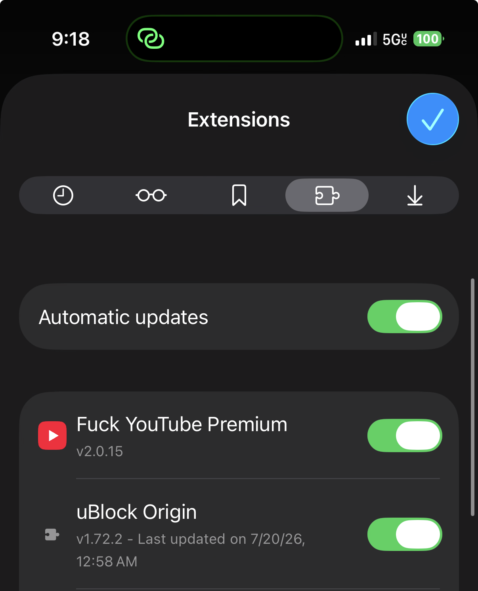
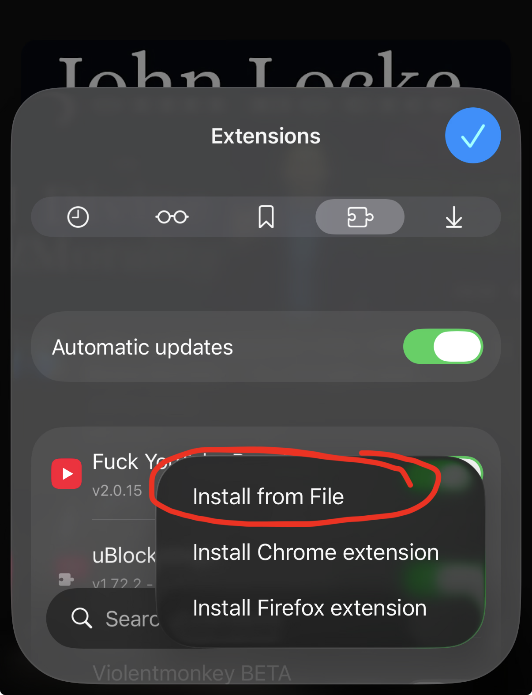

# Install Fuck YouTube Premium on Orion iOS — v2.0.17

Version **2.0.17** fixes the phone search field and adds a clearer iOS, Orion, and manual update guide.

## Install this

**Prefer Chrome zip:**

`/Users/aditauqir/Downloads/userscript/fuck-youtube-premium-chrome-2.0.17.zip`

Firefox fallback:

`/Users/aditauqir/Downloads/userscript/fuck-youtube-premium-firefox-2.0.17.zip`

## Steps

1. [Install Orion Browser from the App Store](https://apps.apple.com/us/app/orion-browser-by-kagi/id1484498200), then download the zip from the [latest GitHub Release](https://github.com/aditauqir/fyp/releases/latest) to the **Downloads** folder in the iOS Files app. Do not unzip it.
2. Open Orion → Settings → Extensions and enable both **Chrome Extensions** and **Firefox Extensions**.
3. **Uninstall** every older “YouTube Mobile for Orion” or “Fuck YouTube Premium” entry.
4. In Orion’s Extensions screen, tap **+** → **Install from File**.
5. Open **Downloads** and select the **Chrome** zip.
6. Enable **Fuck YouTube Premium** in Orion.
7. Install [uBlock Origin from its official Firefox Add-ons listing](https://addons.mozilla.org/en-US/firefox/addon/ublock-origin/) in Orion, then enable it.
8. Allow both **Fuck YouTube Premium** and **uBlock Origin** to access YouTube.
9. Open `https://www.youtube.com`, open Orion’s website settings, and enable **Request Desktop Website**.
10. Hard-refresh, or close the tab and reopen it.

If the Chrome zip does not install, repeat the same steps with the Firefox zip.

**uBlock Origin is required.** Keep it enabled alongside this extension. uBlock Origin handles network ad blocking, while Fuck YouTube Premium handles Orion playback and the mobile-friendly YouTube layout. Its canonical source is the [official `gorhill/uBlock` repository](https://github.com/gorhill/uBlock).

## Final extension result

  

## Updates

Tap the **Fuck YouTube Premium** extension icon and choose **Check for updates**. The extension also checks GitHub every six hours and shows an **UP** badge when a newer version exists. This provides “OTA” update detection and downloads.

Orion’s extension policies do not allow a manually installed zip to replace itself silently. If an update is available, download the offered zip, uninstall the current extension, and **always choose `+` → `Install from File`** to install the new zip from Downloads:

  

## What should be true after install

- Tap Play and the video remains inline above the title and comments.
- One tap on Play starts the video inline; fullscreen occurs only after tapping the player’s fullscreen control.
- The hamburger opens YouTube’s native drawer.
- There is no permanent Home/Shorts/Subscriptions icon column.
- Upload/Create is hidden.
- Watch content has a small mobile gutter and does not extend beyond either edge.
- Home and recommendation feeds use a phone-friendly single column.
- Tapping Search opens YouTube’s native search field at a usable phone width.
- The extension icon opens a bottom-center panel with three priority changes and two large buttons.
- Recommendations appear before YouTube’s native comments.
- Replying to a comment does not zoom the page.
- Player controls hide eight seconds after the last player interaction.
- Closed captions appear once.
- uBlock Origin handles network ad blocking.

If these changes are missing, confirm the extension is enabled and allowed on youtube.com, and confirm **Request Desktop Website** is enabled. If Play invokes the native fullscreen controller, Orion’s app-level inline media setting is overriding the page; report the Orion/iOS version because a WebExtension cannot change its host app’s `WKWebViewConfiguration`.

## If Orion says the extension could not be installed

Close the YouTube tab first. Return to **Orion → Settings → Extensions**, tap **+** → **Install from File**, and select the same downloaded zip again. If Orion repeats the error, keep retrying the install button and selecting the zip until Orion confirms that installation succeeded. Do not unzip the file.
