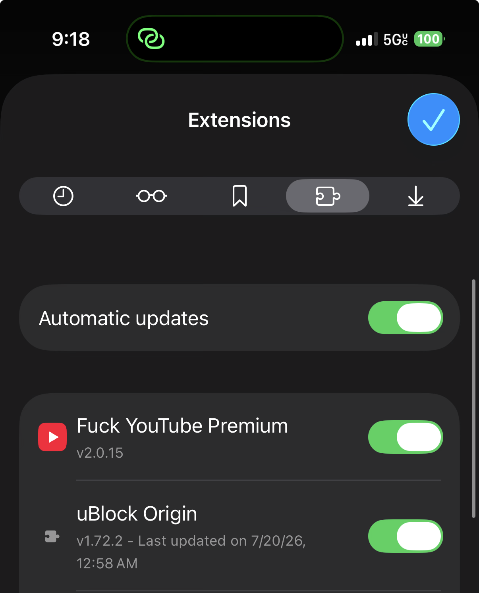
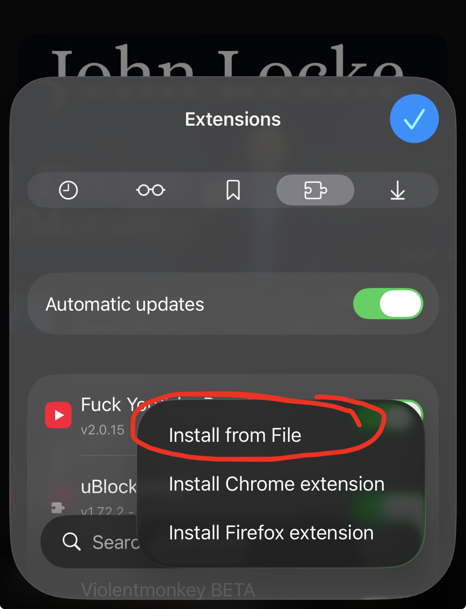
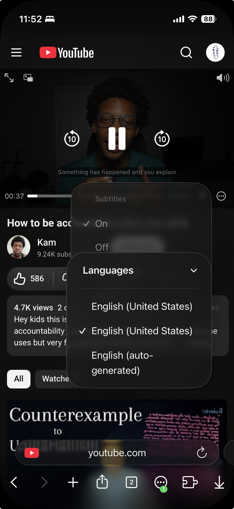

# Install Fyoutube on Orion iOS

This guide matches the install steps in [README.md](README.md). Use the [latest GitHub Release](https://github.com/aditauqir/fyp/releases/latest). The recommended package is the Chrome Manifest V3 `*_release.zip` (example: `3.0.4_release.zip`).

## Packages

| Package | Use |
| --- | --- |
| `*_release.zip` | Recommended install for Orion |
| `fyoutube-orion-*.xpi` | XPI fallback |
| `fyoutube-firefox-*.zip` | Firefox ZIP fallback |
| `fyoutube-chrome-*.zip` | Chrome ZIP fallback |

Do not unzip the file. Do not rename the file.

## Install procedure

1. [Install Orion Browser from the App Store](https://apps.apple.com/us/app/orion-browser-by-kagi/id1484498200).
2. Confirm that your iPhone uses iOS 17 or later.
3. Download the latest `*_release.zip` from the [latest GitHub Release](https://github.com/aditauqir/fyp/releases/latest).
4. Save the zip in **On My iPhone → Downloads**.
5. Open **Orion → Settings → Extensions**.
6. Enable **Chrome Extensions**.
7. Enable **Firefox Extensions**.
8. Uninstall every older **Fyoutube** or **YouTube Mobile for Orion** entry.
9. Tap **+**.
10. Tap **Install from File**.
11. Open **On My iPhone → Downloads**.
12. Select the `*_release.zip` file.
13. Enable **Fyoutube**.
14. Allow **Fyoutube** to access YouTube.
15. Open `https://www.youtube.com`.

If the release zip does not install, repeat the same steps with the Chrome ZIP, then the Firefox ZIP, then the XPI.

### Notes after install

- You do not need uBlock Origin. This extension blocks YouTube ads.
- Do not set Orion **Request Desktop Website** for YouTube. The extension selects the YouTube backend.

## Final extension result

  

## Update procedure

1. Tap the **Fyoutube** extension icon.
2. Tap **Check for updates**.
3. Download the offered zip.
4. Uninstall the current **Fyoutube** extension.
5. Tap **+**.
6. Tap **Install from File**.
7. Select the new zip from local device storage.

The extension also checks GitHub every six hours. When a newer version exists, the icon shows an **UP** badge. Orion does not replace a manually installed extension automatically.

  

## What should be true after install

- Tap Play. The video stays inline above the title and comments.
- Fullscreen starts only when you tap the player fullscreen control.
- The hamburger opens YouTube’s native drawer.
- There is no permanent Home/Shorts/Subscriptions icon column.
- Upload/Create is hidden.
- Watch content stays inside a small mobile gutter.
- Home and recommendation feeds use one column.
- Tap Search. YouTube’s native search field opens at a usable phone width.
- The extension icon opens a bottom-center panel with three priority changes and two large buttons.
- Recommendations appear before YouTube’s native comments.
- A comment reply does not zoom the page.
- Player controls hide ten seconds after the last player interaction.
- Closed captions appear once.
- YouTube ads are blocked by this extension.

If these results are missing:

1. Confirm that **Fyoutube** is enabled.
2. Confirm that the extension can access youtube.com.
3. Close the YouTube tab.
4. Open YouTube again.

If Play opens the native fullscreen controller, Orion’s app-level inline media setting overrides the page. Report the Orion and iOS versions. A WebExtension cannot change the host app `WKWebViewConfiguration`.

## If captions appear twice

  

Orion can leave more than one subtitle track selected in **Languages**. From version 2.2.3 onward, the extension keeps one track active:

1. Prefer an authored English track.
2. If that track is missing, use English auto-generated captions.
3. If that track is missing, use the best remaining option.

If you select another language, that language replaces the default. It does not add a second active track.

## If the extension icon does not open the buttons

1. Uninstall the Firefox/XPI copy.
2. Install the latest `*_release.zip` or `fyoutube-chrome-*.zip`.
3. Enable the extension.
4. Allow YouTube access.
5. Tap the toolbar icon again.

The panel must show three changelog lines, **Go to YouTube**, and **Check for updates**.

## If Orion says the extension could not be installed

1. Close the YouTube tab.
2. Uninstall every older **Fyoutube** entry.
3. In Files, move the downloaded zip from iCloud Drive to **On My iPhone → Downloads**.
4. Open **Orion → Settings → Extensions**.
5. Tap **+**.
6. Tap **Install from File**.
7. Select the local zip.
8. If Orion shows the error again, repeat steps 5–7 until Orion confirms the install.

Do not unzip the file. Do not rename the file.
