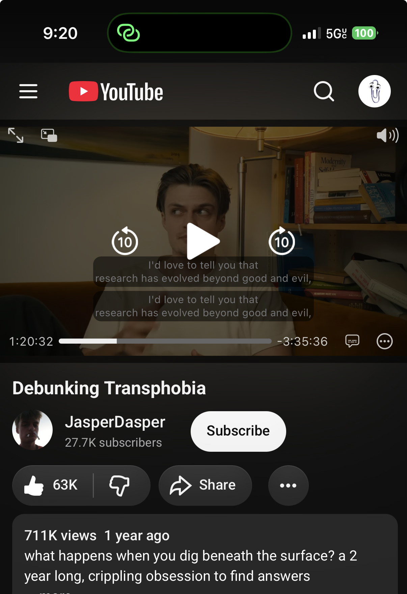

# Fuck YouTube Premium

### Basically free YouTube Premium for iPhone

## What is this?

I built **Fuck YouTube Premium** because I was fed up with App Store apps and partial solutions that never delivered a complete YouTube experience. Orion Browser supports browser extensions on iPhone, and uBlock Origin works in Orion, so I combined them into something closer to the useful parts of YouTube Premium without the subscription.

The extension loads desktop YouTube as its functional backend, then turns it into an iPhone-friendly interface with a full-width inline player, one-column feeds, mobile search, hamburger-only navigation, background playback, and screen-off audio. **uBlock Origin is mandatory for ad blocking**; this extension handles the player and mobile layout. The goal is a free, Premium-like YouTube experience that keeps playing without forcing you into fullscreen or Picture in Picture.

This project is not affiliated with or endorsed by YouTube, Google, Orion, Kagi, or uBlock Origin.

<p align="center">
  <a href="https://apps.apple.com/us/app/orion-browser-by-kagi/id1484498200" title="Install Orion Browser on iPhone">
    
  </a>
  <a href="https://github.com/aditauqir/fyp" title="View the project on GitHub">
    
  </a>
</p>

<p align="center">
  <a href="https://browser.kagi.com/"></a>
  <a href="https://addons.mozilla.org/en-US/firefox/addon/ublock-origin/"></a>
  <a href="https://github.com/aditauqir/fyp/releases/latest"></a>
</p>

The Apple and GitHub icons use [tandpfun/skill-icons](https://github.com/tandpfun/skill-icons).

## iPhone only — Orion Browser

## Install on Orion for iOS

1. On your iPhone, [download Orion Browser from the App Store](https://apps.apple.com/us/app/orion-browser-by-kagi/id1484498200). Orion currently requires iOS 17 or later.
2. Open **Orion → Settings → Extensions**, then enable support for both **Chrome Extensions** and **Firefox Extensions**.
3. **Mandatory for ad blocking:** install [uBlock Origin from its official Firefox Add-ons listing](https://addons.mozilla.org/en-US/firefox/addon/ublock-origin/), enable it, and allow it to access YouTube.
4. Tap the green **Download Latest Release** button above, then download [fuck-youtube-premium-orion-2.0.18.xpi](fuck-youtube-premium-orion-2.0.18.xpi). This Firefox-format XPI is the recommended Orion installer. The [Chrome zip](fuck-youtube-premium-chrome-2.0.18.zip) and [Firefox zip](fuck-youtube-premium-firefox-2.0.18.zip) remain available as fallbacks.
5. In Orion’s Extensions screen, tap **+**, then **Install from File**.
6. Select the downloaded XPI. Do not unzip or rename it.
7. Enable **Fuck YouTube Premium**.
8. Allow both **Fuck YouTube Premium** and **uBlock Origin** to access YouTube.
9. Open [youtube.com](https://www.youtube.com/), enable **Request Desktop Website** in Orion’s website settings, and refresh the page.

The Orion XPI is recommended because [Orion supports Firefox, Chrome, and file-based extensions](https://help.kagi.com/orion/browser-extensions/ios-ipados-extensions.html), and its issue tracker confirms XPI support. **uBlock Origin is required and must stay enabled alongside this extension.** Its canonical source is the [official `gorhill/uBlock` repository](https://github.com/gorhill/uBlock).

## Final extension result

After the steps above, both **Fuck YouTube Premium** and **uBlock Origin** should be enabled in Orion:

<p align="center">
  
</p>

## Screenshots

| Inline YouTube watch page | Phone-friendly recommendation feed |
| --- | --- |
|  |  |

## Extension menu and updates

Tap the extension icon to open a bottom-center popup panel. It occupies roughly one-third of the phone screen, shows the three highest-priority release notes, and contains only two large buttons:

- **Go to YouTube** opens desktop YouTube.
- **Check for updates** compares the installed version with the latest GitHub Release. When an update is available, the button downloads the Orion-first XPI.

The extension provides “OTA” update detection and downloads: it checks GitHub periodically and shows an **UP** badge when a newer release exists. Manual checks first ask the background update service and automatically fall back to a direct GitHub request if Orion has suspended it.

Due to Orion’s extension policies, a manually installed extension cannot silently replace itself. **Always uninstall the old version first, then install the downloaded XPI manually with `+` → `Install from File`**:

<p align="center">
  
</p>

After downloading the update, remove the old extension, choose **Install from File**, and select the new XPI.

### Release history policy

Old GitHub Releases and their downloads are always preserved. Whenever a new version becomes the latest release, every older release title is prefixed with **`[DEPRECATED]`** so users can immediately identify the current build without losing access to previous versions.

## Update

Remove the older copy from Orion, download the newest XPI from [GitHub Releases](https://github.com/aditauqir/fyp/releases), and repeat the installation steps above. More troubleshooting is available in [INSTALL-ORION.md](INSTALL-ORION.md).

## Troubleshooting

### Orion says the extension could not be installed

1. Close the YouTube tab in Orion first.
2. Return to **Orion → Settings → Extensions**.
3. Confirm that every older **Fuck YouTube Premium** entry has been uninstalled.
4. In Files, move the downloaded XPI out of iCloud Drive and into **On My iPhone → Downloads**.
5. Tap **+** → **Install from File** and select the local XPI again.
6. If Orion repeats the error, keep retrying the install button and selecting the same XPI until Orion confirms that the extension was installed.

Do not unzip or rename the file. [Orion’s issue tracker](https://orionfeedback.org/d/936-install-from-file-for-extensions/15) recommends moving extension files to device storage when iCloud permissions interfere with installation. After installation succeeds, enable **Fuck YouTube Premium**, reopen YouTube, and confirm that both this extension and uBlock Origin are allowed to access the site.

## Build from source

Run:

```bash
./rebuild-extension.sh
```

The build validates the generated JavaScript and writes the recommended Orion XPI plus Chrome and Firefox zip fallbacks to this folder.

Release history is maintained in [PATCH_NOTES.md](PATCH_NOTES.md). Agent and developer documentation is in [ARCHITECTURE.md](ARCHITECTURE.md), with current implementation history and handoff notes in [HANDOFF.md](HANDOFF.md).

## Contributing

Want to improve the extension or fix a bug? Fork the repository and [send a pull request](https://github.com/aditauqir/fyp/compare).
