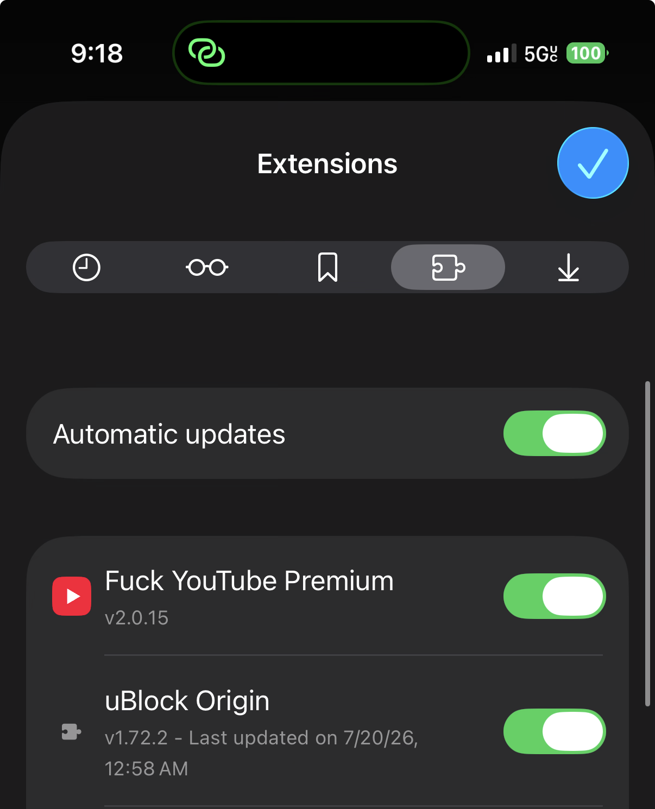
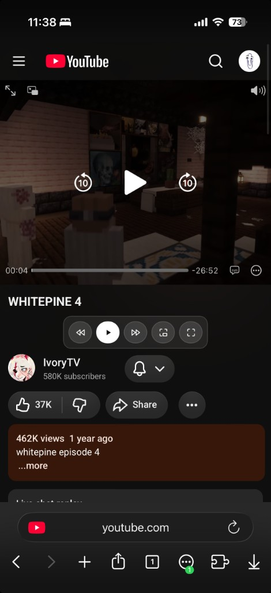
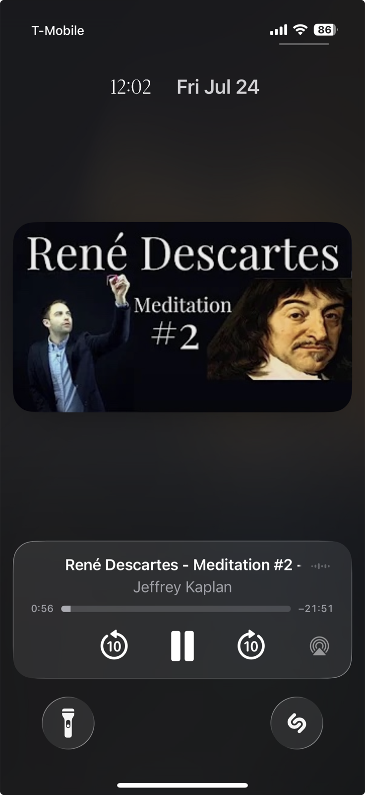
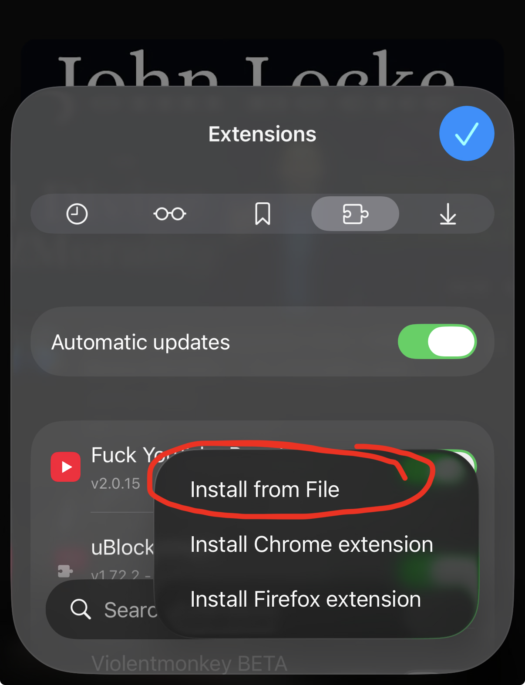
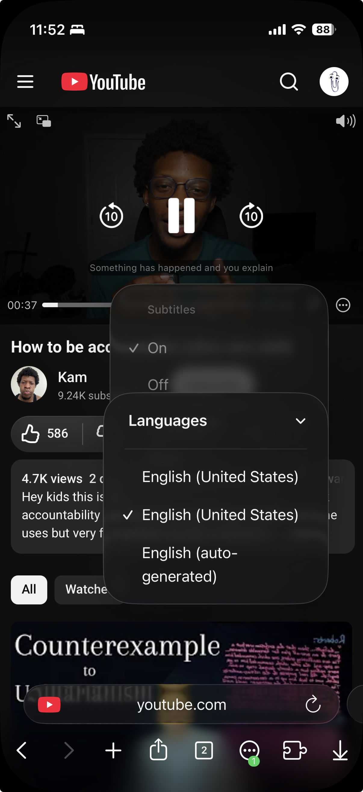

# Fuck YouTube Premium- Get Free YTPremium on iPhone
<p align="center">
  <a href="https://apps.apple.com/us/app/orion-browser-by-kagi/id1484498200" title="Install Orion Browser on iPhone">
    
  </a>
  <a href="https://github.com/aditauqir/fyp" title="View the project on GitHub">
    
  </a>
</p>

<p align="center">
  <a href="https://browser.kagi.com/"></a>
  <a href="https://addons.mozilla.org/en-US/firefox/addon/ublock-origin/"></a>
  <a href="https://github.com/aditauqir/fyp/releases/latest"></a>
</p>

<p align="center">
  <a href="https://discord.gg/sd5Y8f7ukh"></a>
</p>

## What is this?

I built **Fuck YouTube Premium** because I was fed up with App Store apps and partial solutions that never delivered a good YouTube experience (even if they did, it was paid and locked up for some reason). Orion Browser supports browser extensions on iPhone, and uBlock Origin works in Orion, so I combined them into something closer to the useful parts of YouTube Premium without the subscription.

#### The Architecture
The extension loads desktop YouTube as its functional backend, then turns it into an iPhone-friendly interface with a full-width inline player, one-column feeds, mobile search, hamburger-only navigation, background playback, and screen-off audio. This does not currently use any youtube api yet, but im working on it. It basically just rearranges stuff on the webpage by loading a desktop version of youtube.

### Notes
**uBlock Origin is mandatory for ad blocking**; this extension handles the player and mobile layout. The goal is a free, Premium-like YouTube experience that keeps playing without forcing you into fullscreen or Picture in Picture.

This project is not affiliated with or endorsed by YouTube, Google, Orion, Kagi, or uBlock Origin.


## iPhone only — Orion Browser

This extension is for iPhone. It is not made for iPad.

## Install on Orion for iOS (iPhone only)

Use these packages from the [latest GitHub Release](https://github.com/aditauqir/fyp/releases/latest):

| Package | Use |
| --- | --- |
| `*_release.zip` (example: `2.2.3_release.zip`) | Recommended install for Orion |
| `fuck-youtube-premium-chrome-*.zip` | Chrome Manifest V3 fallback |
| `fuck-youtube-premium-firefox-*.zip` | Firefox ZIP fallback |
| `fuck-youtube-premium-orion-*.xpi` | XPI fallback |

Do not unzip the file. Do not rename the file.

### Before you install

1. On your iPhone, [install Orion Browser from the App Store](https://apps.apple.com/us/app/orion-browser-by-kagi/id1484498200).
2. Confirm that your iPhone uses iOS 17 or later.
3. If an older **Fuck YouTube Premium** build is installed, uninstall that build.

### Install procedure

1. Open **Orion**.
2. Open **Settings → Extensions**.
3. Enable **Chrome Extensions**.
4. Enable **Firefox Extensions**.
5. Install [uBlock Origin from the official Firefox Add-ons listing](https://addons.mozilla.org/en-US/firefox/addon/ublock-origin/).
6. Enable **uBlock Origin**.
7. Download the latest `*_release.zip` from [GitHub Releases](https://github.com/aditauqir/fyp/releases/latest).
8. Save the zip in **On My iPhone → Downloads**.
9. In **Extensions**, tap **+**.
10. Tap **Install from File**.
11. Select the `*_release.zip` file.
12. Enable **Fuck YouTube Premium**.
13. Allow **Fuck YouTube Premium** to access YouTube.
14. Allow **uBlock Origin** to access YouTube.
15. Open [youtube.com](https://www.youtube.com/).

### Notes after install

- Keep **uBlock Origin** enabled. uBlock Origin blocks ads. This extension controls the player and the phone layout.
- Do not set Orion **Request Desktop Website** for YouTube. The extension selects the YouTube backend.
- Orion iOS extension support is [still preliminary](https://help.kagi.com/orion/browser-extensions/ios-ipados-extensions.html).
- If the release zip does not install, use the Chrome ZIP, then the Firefox ZIP, then the XPI.
- The canonical source for uBlock Origin is the [official `gorhill/uBlock` repository](https://github.com/gorhill/uBlock).

## Final extension result

After the install procedure, both extensions must be enabled in Orion:

<p align="center">
  
</p>

## Screenshots

| YouTube native app like experienc | Phone-friendly recommendation feed |
| --- | --- |
|  |  |

### AirPlay and Return YouTube Dislike

The inline player includes an AirPlay button. Return YouTube Dislike also restores the public dislike count beside YouTube's like button.

<p align="center">
  
</p>

### Background Player options on iPhone

The video keeps playing from the iPhone Lock Screen, including when the display is off:

<p align="center">
  
</p>

## Extension menu and updates

1. Tap the extension icon.
2. Read the three highest-priority release notes in the panel.
3. Tap **Go to YouTube** to open desktop YouTube.
4. Tap **Check for updates** to compare the installed version with the latest GitHub Release.

The extension also checks GitHub on a schedule. When a newer release exists, the icon shows an **UP** badge.

Orion does not replace a manually installed extension automatically. Use this update procedure:

1. Download the new release zip.
2. Uninstall the old **Fuck YouTube Premium** extension.
3. Tap **+**.
4. Tap **Install from File**.
5. Select the new release zip.

<p align="center">
  
</p>

### Release history policy

Old GitHub Releases and their downloads stay available. When a new version becomes the latest release, each older release title gets the prefix **`[DEPRECATED]`**.

## Update

1. Uninstall the older **Fuck YouTube Premium** copy in Orion.
2. Download the newest release zip from [GitHub Releases](https://github.com/aditauqir/fyp/releases).
3. Repeat the install procedure above.

For more steps, see [INSTALL-ORION.md](INSTALL-ORION.md).

## Troubleshooting

### Do not enable Request Desktop Website

1. Open Orion site settings for YouTube.
2. Set **Request Desktop Website** to off.
3. Close the YouTube tab.
4. Open YouTube again.

Fuck YouTube Premium already selects the desktop backend and then applies the phone layout. If Orion desktop mode stays on, the interface can enlarge or misalign.

### Captions appear twice or multiple languages are selected

Orion’s native **Subtitles → Languages** menu can leave more than one subtitle track selected:

<p align="center">
  
</p>

From version 2.2.3 onward, the extension keeps one subtitle track active:

1. Prefer an authored English track.
2. If that track is missing, use English auto-generated captions.
3. If that track is missing, use the best remaining subtitle.

Duplicate English rows are collapsed. If you select another language, that language replaces the default. It does not add a second active track.

### Tapping the extension icon shows no buttons

1. Uninstall the Firefox/XPI build.
2. Install the latest `fuck-youtube-premium-chrome-*.zip` or `*_release.zip`.
3. Enable the extension.
4. Allow YouTube access.
5. Tap the toolbar icon again.

The panel must show three changelog lines, **Go to YouTube**, and **Check for updates**. Keep the XPI only if Orion cannot install the Chrome package.

### Orion says the extension could not be installed

1. Close the YouTube tab in Orion.
2. Open **Orion → Settings → Extensions**.
3. Uninstall every older **Fuck YouTube Premium** entry.
4. In Files, move the downloaded release zip from iCloud Drive to **On My iPhone → Downloads**.
5. Tap **+**.
6. Tap **Install from File**.
7. Select the local zip.
8. If Orion shows the error again, repeat steps 5–7 until Orion confirms the install.
9. Enable **Fuck YouTube Premium**.
10. Allow YouTube access for **Fuck YouTube Premium** and **uBlock Origin**.
11. Open YouTube again.

Do not unzip the file. Do not rename the file. [Orion’s issue tracker](https://orionfeedback.org/d/936-install-from-file-for-extensions/15) recommends device storage when iCloud permissions block install. If the release zip still fails, try the Orion ZIP or the XPI.

## Build from source

Run:

```bash
./rebuild-extension.sh
```

The build validates the generated JavaScript and writes the recommended Orion release ZIP plus Chrome, Firefox, Orion ZIP, and XPI fallbacks locally. Generated packages are ignored by Git and published through [GitHub Releases](https://github.com/aditauqir/fyp/releases), keeping the source tree clean.

Release history is maintained in [PATCH_NOTES.md](PATCH_NOTES.md). Agent and developer documentation is in [ARCHITECTURE.md](ARCHITECTURE.md), with current implementation history and handoff notes in [HANDOFF.md](HANDOFF.md).

## Contributing

Want to improve the extension or fix a bug? Fork the repository and [send a pull request](https://github.com/aditauqir/fyp/compare).
